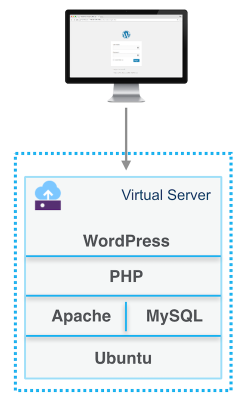
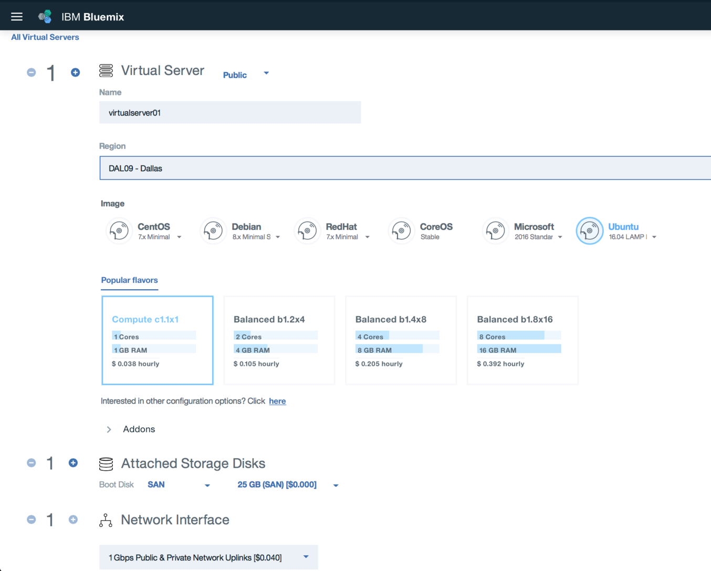
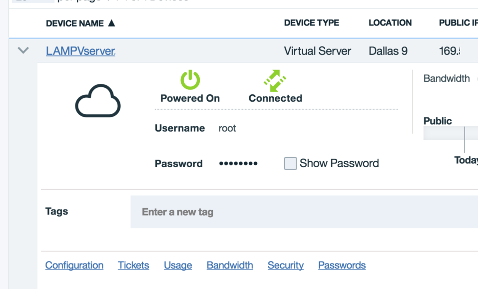
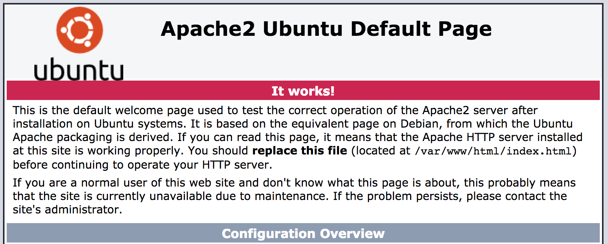
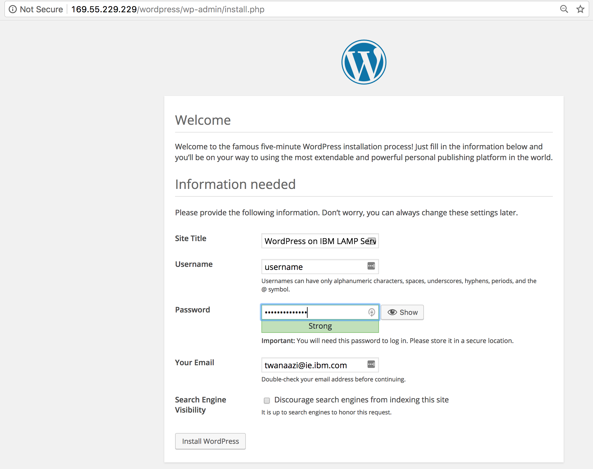

# PHP web application on a LAMP Stack using IBM Bluemix
This solution walks you through how to deploy an Apache web server, MySQL, and PHP (the LAMP stack) on a virtual server using Ubuntu image. To see the LAMP server in action, you can optionally install and configure a WordPress site. 

Steps: 4 | 15 minutes

## Objectives
In this tutorial, you deployed a LAMP server in IBM Cloud. 
* Provision a LAMP server 
* Install Apache, MySQL, and PHP
* Verify installation and configuration
* Install WordPress



### Apps and Services
* Virtual Server

## Step 1 - Provision a LAMP server 
1. Login to Bluemix, navigate to the catalog page and select the virtual server service under the Infrastructure section. 

2. Select public virtual server and then click create

3. Configure the server, for this solution select the Ubuntu LAMP latest version  

    **Note:** this will come with pre-installed Apache, MySQL, and PHP but we will reinstall PHP and MySQL later with the latest version.
  
4. Under network interface select the public and private network uplinks option

5. Once you are happy with the configuration, then click provision to provision the server.  

    **Note** the provisioning process can take up to 10 minutes for the server to be ready for use. 
   
   
 
    Once the server is created, you should see the server username, password, and public IP.  
    The server username and password would be needed to SSH into the server and the public IP address to access the web application. 
    
 

## Step 2 - Reinstall Apache, MySQL, and PHP
1. Run the following command to update Ubuntu package sources and reinstall Apache, MySQL, and PHP with latest versions.  

   ```
   sudo apt update && sudo apt install lamp-server^
   ```
   **Note** the caret (^) at the end of the command.


## Step 3 - Verify installation and configuration
Verify Apache, MySQL, and PHP running on Ubuntu image.

### Ubuntu
1. Verify Ubuntu by opening in the public IP address in the browser. You should see the Ubuntu welcome page.

    

### Apache
1. Check Apache version installed using the following command:
   
   ```
   apache2 -v
   ```
2. Verify port 80 for web traffic, run the following command: 
   
   ```
   sudo netstat -ntlp | grep LISTEN
   ```
     

### MySQL
1. Check the version of MySQL using the following command:
   
   ```
   mysql -V
   ```
   **Note** the capital V parameter

2. We recommend running the following script to help securing MySQL database:

   ```
   mysql_secure_installation
   ```

3. Enter MySQL root password, and configure the security settings for your environment.
   If you want to create a MySQL database, add users, or change configuration settings, login to MySQL

   ```
   mysql -u root -p
   ```
   
   **Note** MySQL default username and password is root root.  
   When done, exit the mysql prompt by typing \q.
   
### PHP
1. Check the version of PHP using the following command:

   ```
   PHP -v 
   ```
2. If you want to test further, create a quick PHP info page to view in a browser. The following command creates the PHP info page:

   ```
   sudo sh -c 'echo "<?php phpinfo(); ?>" > /var/www/html/info.php'
   ```
   Now you can check the PHP info page you created. Open a browser and go to http://YourPublicIPAddress/info.php. Substitute the public IP address of your virtual server. It should look similar to this image.
     

## Step 4 - Install WordPress
If you want to try your LAMP stack, install a sample app. As an example, the following steps install the open source WordPress platform to create websites and blogs. This WordPress setup is for proof of concept. For more information and settings for production installation, see the WordPress documentation.

### Install the WordPress packages
1. Run the following command:

   ```
   sudo apt install wordpress
   ```
### Configure WordPress
1. Configure WordPress to use MySQL and PHP. Run the following command to open a text editor of your choice and create the file /etc/wordpress/config-localhost.php

   ```
   sudo sensible-editor /etc/wordpress/config-localhost.php
   ```
   
2. Copy the following lines to the file, substituting your database password for yourPassword (leave other values unchanged). Then save using Ctrl+X to exit and save the file.   
   ```
   <?php 
   define('DB_NAME', 'wordpress'); 
   define('DB_USER', 'wordpress'); 
   define('DB_PASSWORD', 'yourPassword'); 
   define('DB_HOST', 'localhost'); 
   define('WP_CONTENT_DIR', '/usr/share/wordpress/wp-content'); 
   ?>
   ```  
   
3. In a working directory, create a text file wordpress.sql to configure the WordPress database:

   ```
   sudo sensible-editor wordpress.sql
   ```

4. Add the following commands, substituting your database password for yourPassword (leave other values unchanged). Then save the file.

   ```
   CREATE DATABASE wordpress; 
   GRANT SELECT,INSERT,UPDATE,DELETE,CREATE,DROP,ALTER ON wordpress.* 
   TO wordpress@localhost 
   IDENTIFIED BY 'yourPassword'; 
   FLUSH PRIVILEGES;
   ```

5. Run the following command to create the database:

   ```
   cat wordpress.sql | sudo mysql --defaults-extra-file=/etc/mysql/debian.cnf
   ```

6. After the command completes, delete the file wordpress.sql. Move the WordPress installation to the web server document root:
 
   ```
   sudo ln -s /usr/share/wordpress /var/www/html/wordpress
   sudo mv /etc/wordpress/config-localhost.php /etc/wordpress/config-default.php
   ```  
7. Done, now you can complete the WordPress setup and publish on the platform. Open a browser and go to http://yourPublicIPAddress/wordpress. Substitute the public IP address of your VM. It should look similar to this image.
     

 
## Summary 
In this tutorial, you deployed a LAMP server using IBM Cloud. You learned how to:
* Provision a LAMP server 
* Install Apache, MySQL, and PHP
* Verify installation and configuration
* Install WordPress


## Next step 
Advance to the next tutorial to learn how to:
* Secure web servers with SSL certificates.  
* Add auto-scaling.  
