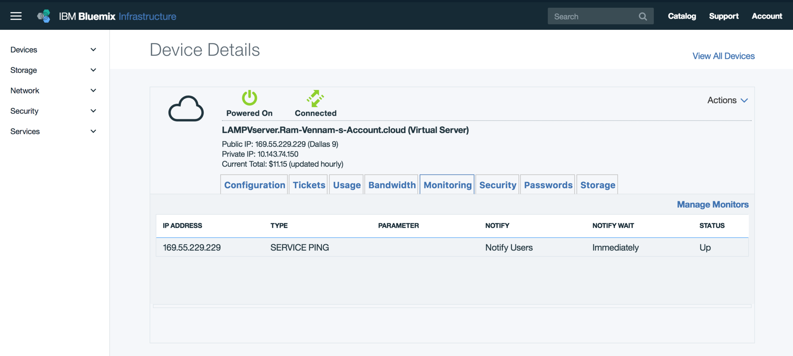
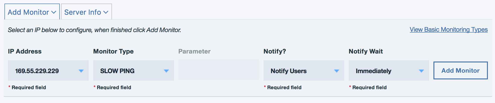
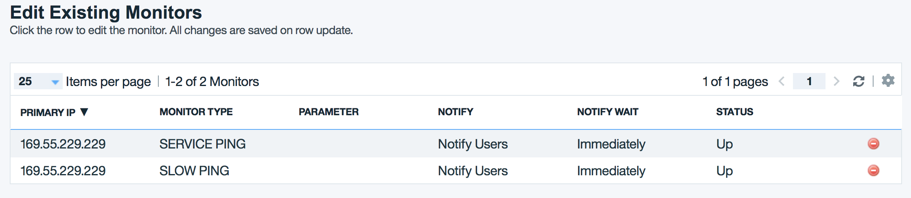
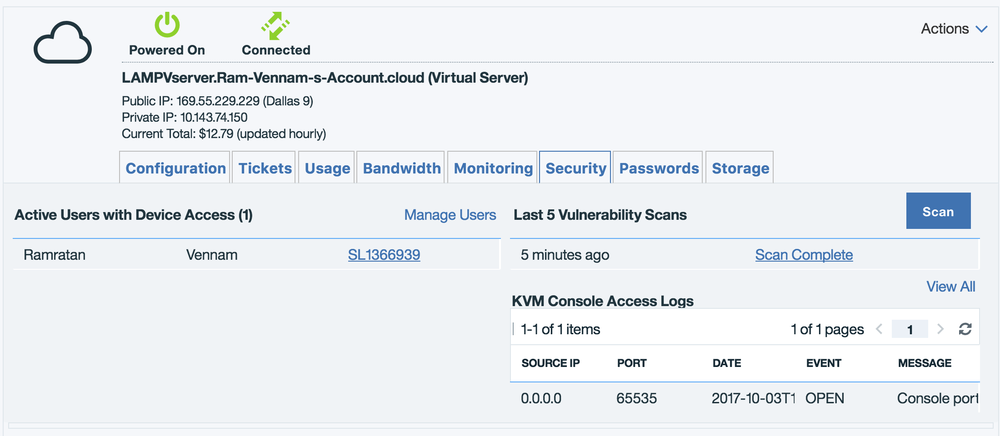
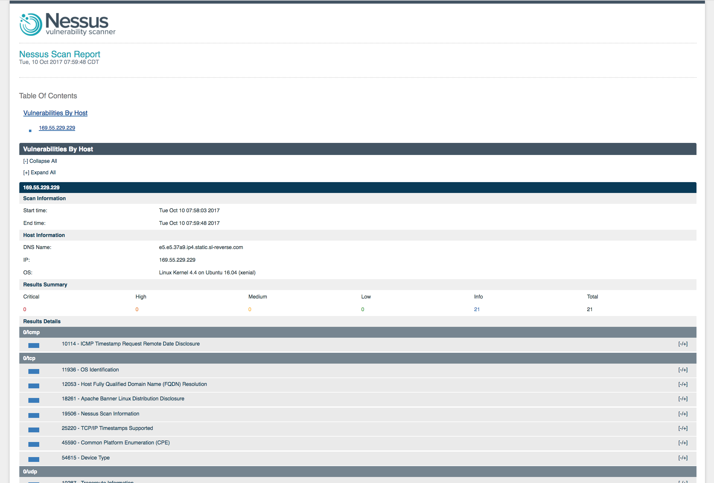

# PHP web application on a LAMP Stack
This solution walks you through the creation of an Ubuntu **L**inux virtual server, with **A**pache web server, **M**ySQL, and **P**HP (the LAMP stack). To see the LAMP server in action, you will install and configure the [WordPress](https://wordpress.org/) open source application. 

Time to complete: 15 minutes

## Objectives
* Provision a LAMP server 
* Install Apache, MySQL, and PHP
* Verify installation and configuration
* Install and configure WordPress
* Server monitoring and usage
* Server Security


## Step 1 - Provision a LAMP server 
1. Login to **Bluemix**, navigate to the **Catalog** page and select the **Virtual Server** service under the **Infrastructure** section. 

2. Select **Public Virtual Server** and then click **Create**

3. Under **Image**, select **** **LAMP** latest version  under **Ubuntu**

    **Note:** this will come with pre-installed with Apache, MySQL, and PHP but we will reinstall PHP and MySQL with the latest version.

4. Under **Network Interface** select the **Public and Private Network Uplink** option

5. Review the other configuration options, then click **Provision** to provision the server. 

    **Note**: The provisioning process can take up to 10 minutes for the server to be ready for use. 

   

  	  Once the server is created, you should see the server username, password, and public IP.  The server username and password would be needed to SSH into the server and the public IP address to access the web application. 


## Step 2 - Re-install Apache, MySQL, and PHP
1. Run the following command to update Ubuntu package sources and reinstall Apache, MySQL, and PHP with latest versions.  

   ```sh
   sudo apt update && sudo apt install lamp-server^
   ```
   **Note** the caret (^) at the end of the command.


## Step 3 - Verify installation and configuration
Verify Apache, MySQL, and PHP running on Ubuntu image.

### Ubuntu
1. Verify Ubuntu by opening in the **Public IP** address in the browser. You should see the Ubuntu welcome page.

    

### Apache
1. Check Apache version installed using the following command:

   ```
   apache2 -v
   ```
2. Verify port 80 for web traffic, run the following command: 

   ```
   sudo netstat -ntlp | grep LISTEN
   ```
     

### MySQL
1. Check the **version** of MySQL using the following command:

   ```sh
   mysql -V
   ```

2. Run the following script to help secure MySQL database:

   ```sh
   mysql_secure_installation
   ```

3. Enter MySQL root **password**, and configure the security settings for your environment.
   To create a MySQL database, add users, or change configuration settings, login to MySQL

   ```sh
   mysql -u root -p
   ```

   **Note** MySQL default username and password is root and root.  
   When done, exit the mysql prompt by typing \q.

### PHP
1. Check the version of PHP using the following command:

   ```sh
   PHP -v 
   ```
2. If you want to test further, create a quick PHP info page to view in a browser. The following command creates the PHP info page:

   ```sh
   sudo sh -c 'echo "<?php phpinfo(); ?>" > /var/www/html/info.php'
   ```
   Now you can check the PHP info page you created. Open a browser and go to http://YourPublicIPAddress/info.php. Substitute the public IP address of your virtual server. It should look similar to this image.
     

## Step 4 - Install and configure WordPress
If you want to try your LAMP stack, install a sample app. As an example, the following steps install the open source WordPress platform to create websites and blogs. For more information and settings for production installation, see the WordPress documentation.

### Install the WordPress packages
1. Run the following command to install WordPress:

   ```sh
   sudo apt install wordpress
   ```
### Configure WordPress
1. Configure WordPress to use MySQL and PHP. Run the following command to open a text editor and create the file /etc/wordpress/config-localhost.php

   ```sh
   sudo sensible-editor /etc/wordpress/config-localhost.php
   ```

2. Copy the following lines to the file, substituting *yourPassword* with your MySQL database password (leave other values unchanged). Then save using Ctrl+X to exit and save the file.   
   ```php
   <?php 
   define('DB_NAME', 'wordpress'); 
   define('DB_USER', 'wordpress'); 
   define('DB_PASSWORD', 'yourPassword'); 
   define('DB_HOST', 'localhost'); 
   define('WP_CONTENT_DIR', '/usr/share/wordpress/wp-content'); 
   ?>
   ```

3. In a working directory, create a text file wordpress.sql to **configure the WordPress database**:

   ```sh
   sudo sensible-editor wordpress.sql
   ```

4. Add the following commands, substituting your database password for yourPassword (leave other values unchanged). Then save the file.

   ```mssql
   CREATE DATABASE wordpress; 
   GRANT SELECT,INSERT,UPDATE,DELETE,CREATE,DROP,ALTER ON wordpress.* 
   TO wordpress@localhost 
   IDENTIFIED BY 'yourPassword'; 
   FLUSH PRIVILEGES;
   ```

5. Run the following command to **create the database**:

   ```sh
   cat wordpress.sql | sudo mysql --defaults-extra-file=/etc/mysql/debian.cnf
   ```

6. After the command completes, delete the file wordpress.sql. Move the WordPress installation to the web server document root:

   ```sh
   sudo ln -s /usr/share/wordpress /var/www/html/wordpress
   sudo mv /etc/wordpress/config-localhost.php /etc/wordpress/config-default.php
   ```
7. Complete the WordPress setup and publish on the platform. Open a browser and go to http://yourVMPublicIPAddress/wordpress. Substitute the public IP address of your VM. It should look similar to this image.
     
   
-----------
   
## Configure Domain
To point your domain to the LAMP server, simply point the A record the server public IP address. 
You can get the server public IP address from the dashboard. 

## Server monitoring and usage
The correct monitoring must be in place for any production application. Below we will explore the options available to monitor a LAMP stack sever and understand the usage of the server at any given time.

### Server Monitoring
There are two basic monitoring types SERVICE PING and SLAW PING.  
- **SERVICE PING:** Test ping to address  
- **SLOW PING:** Test ping address, will not fail on slow server response due to high latency or high server load.  

Service ping is added by default so let's add Slow ping. To add Slow ping monitoring, follow the steps below:
1. From the dashboard, select your server from the list of devices and then click on the **monitoring** tab. 
       
2. Click on the **Manage Monitors** button
3. Add the **SLOW PING** monitoring option and then click on Add Monitoring, for the IP address select your Public IP address.
        
  **Note** duplicate monitors with the same configurations wont be allowed, only 1 monitor per configuration can be created.   

4. Done, with that in place, you should now receive notification alert to your Bluemix account email address. 
          

### Server Usage
1. Next, we want to track the usage to understand the current usage of the server memory and CPU, this can be found under the usage tab.
         


## Server Security
With Bluemix Virtual Servers, you have several security options like vulnerability scanner and add-on firewalls.

### Vulnerability Scanner
The vulnerability scanners scans the server for any vulnerabilities related to the server. To run a vulnerability scan on the server follow the steps below.

1. From the dashboard, select your server and then click on the security tab.  
2. Click on the **scan** button and to start the scan. The scan can take up to 10 minutes depending the type of application running on your server.  
3. Once the scan is completed, you should see a "Scan Complete" button to view the scan report.
         
4. Click on the "Scan complete" button to view the report. View the report for any vulnerabilities. Expand on each of the results by clicking on the -+ buttons on the right. The report should look like below:
         

### Firewalls
Another way to secure the server is by adding firewall to the server. With Bluemix Virtual Servers, you have several firewall options that provide an essential security layer. The firewall options are provisioned on demand, without service interruptions. The firewall services prevent unwanted traffic from hitting your servers, reducing the likelihood of an attack and allowing your server resources to be dedicated for their intended use.  

Firewalls are available as an add-on feature for all servers on the Infrastructure public network. As part of the ordering process, you can select device-specific hardware or a software firewall to provide protection. Alternatively, you can deploy dedicated firewall appliances to the environment and deploy the virtual server to a protected VLAN.   
Learn more on firewalls [here](http://knowledgelayer.softlayer.com/topic/firewall).


## Summary 
In this tutorial, you deployed a LAMP server using IBM Cloud. You learned how to:
* Provision a LAMP server 
* Re-install Apache, MySQL, and PHP
* Verify installation and configuration
* Install and configure WordPress
* Configure domain 
* Server monitoring and usage
* Server Security


## Next steps 
Advance to the next tutorial to learn how to:
* [Use IBM Compose for MySQL service instead of the traditional MySQL database.]()
